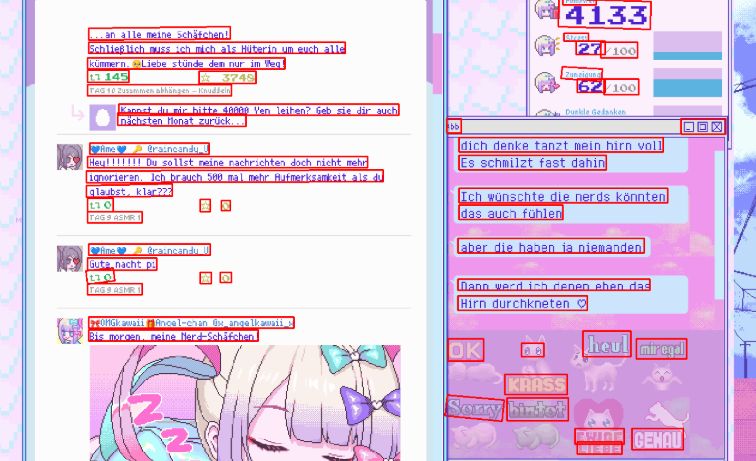
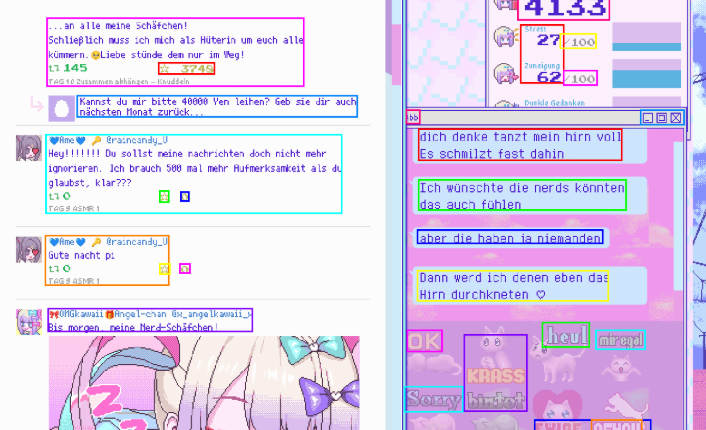

[English](README.md) | [中文](readmeZH.md)

# Ohmytext
A pure OCR-based game text recognition overlay solution that uses PaddleOCR to detect text line positions in game screenshots, merges nearby lines into larger rectangles, crops and sends them to LunaTranslator's OCR API for text recognition, generates corresponding rectangles on a webpage based on their positions, inserts the OCR text, and finally uses AI to correct the recognized text.

# PaddleOCR Detection and Merge Results
## TextDetection_ocr_debug.py


## Algorithm Merge


# In-Game Usage Demo
## Game Screenshot

## Webpage (with screenshot, opaque)

## Webpage (transparent overlay)


---
# Usage Guide
## Determine PaddlePaddle and CUDA Version

[Getting Started - PaddlePaddle](https://www.paddlepaddle.org.cn/install/quick?docurl=/documentation/docs/zh/install/pip/linux-pip.html)

[sdcb/PaddleSharp: .NET/C# binding for Baidu paddle inference library and PaddleOCR](https://github.com/sdcb/PaddleSharp?tab=readme-ov-file#native-packages-%EF%B8%8F)

## Install CUDA

## Install PaddleOCR

[Text Detection Module - PaddleOCR Documentation](https://www.paddleocr.ai/main/version3.x/module_usage/text_detection.html?utm_source=chatgpt.com#_3)
[Installation - PaddleOCR Documentation](https://www.paddleocr.ai/main/version3.x/installation.html)

## Start the Overlay Web Service

```bash
cd ocr-server
npm install
npm start
```

## Start LunaTranslator OCR API Service
[HIllya51/LunaTranslator: Visual Novel Translator](https://github.com/HIllya51/LunaTranslator)

Select an OCR engine, SnippingTool is recommended.

Note: We only use PaddleOCR's text box detection, not its OCR recognition, because PaddleOCR's OCR recognition performance is not ideal, while its text box detection works exceptionally well.

## Start the OCR Recognition Program
Edit the .env file and set the variables

```bash
cd paddleOcr_archieve
python TextDetection_ocr_Cover_ai.py
```

---

# Tips
## Browser Transparency
[iwill123/Window2Clear: A lightweight Windows desktop tool for controlling window transparency, centering, and shake effects.](https://github.com/iwill123/Window2Clear)
## Web Application Mode
Install the application as an app through the browser to display only the top bar without other browser elements.