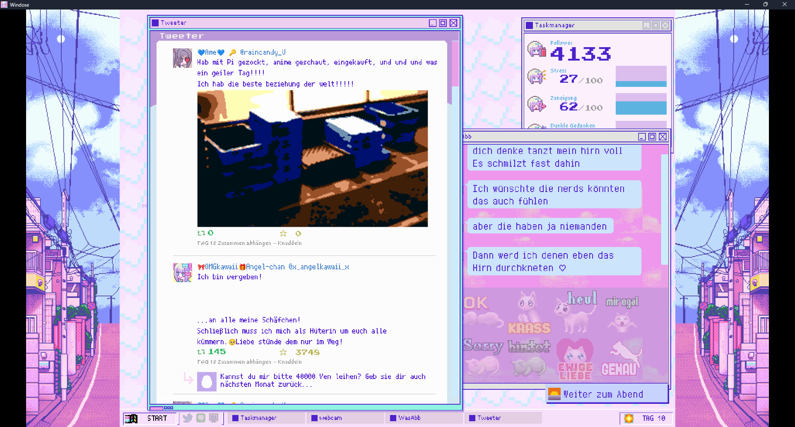
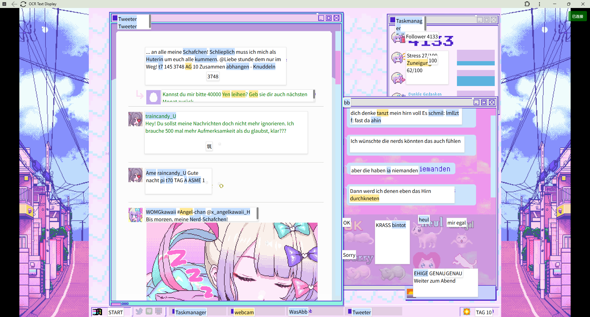

# Ohmytext
通过paddleocr识别游戏截图中的文本每行位置，将行距离较近的合并为更大的矩形，然后裁切后将其发送给Lunatranslator的OCR API返回到网页中对应的位置，最后通过AI对识别到的文本进行修正。
最终实现纯OCR方案的游戏文本识别覆盖层。

# paddle识别结果和合并展示


# 游戏中使用效果展示
## 游戏截图

## 网页（带截图，不透明）

## 网页（透明覆盖透明）


---
# 使用教程
## 确定飞桨版本和CUDA版本

[开始使用_飞桨-源于产业实践的开源深度学习平台](https://www.paddlepaddle.org.cn/install/quick?docurl=/documentation/docs/zh/install/pip/linux-pip.html)

[sdcb/PaddleSharp: .NET/C# binding for Baidu paddle inference library and PaddleOCR](https://github.com/sdcb/PaddleSharp?tab=readme-ov-file#native-packages-%EF%B8%8F)

## 安装CUDA

## 安装PaddleOCR

[文本检测模块 - PaddleOCR 文档](https://www.paddleocr.ai/main/version3.x/module_usage/text_detection.html?utm_source=chatgpt.com#_3)
[安装 - PaddleOCR 文档](https://www.paddleocr.ai/main/version3.x/installation.html)

## 启动覆盖层网页服务

```bash
cd ocr-server
npm install
npm start
```

## 启动Lunatranslator OCR API服务
[HIllya51/LunaTranslator: 视觉小说翻译器 / Visual Novel Translator](https://github.com/HIllya51/LunaTranslator)

选择一个OCR引擎，推荐SnippingTool

没错，我们仅使用paddleOCR的文本框检测，而不使用其OCR，因为paddleOCR的OCR识别效果并不好，而文本框检测效果则非常好。

## 启动OCR识别程序
编辑.env文件，设置变量

```bash
cd paddleOcr_archieve
python TextDetection_ocr_Cover_ai.py
```

---

# 技巧
## 浏览器透明
[iwill123/Window2Clear: 一个轻量级的Windows桌面工具，用于控制窗口透明度、居中和抖动效果。](https://github.com/iwill123/Window2Clear)
## 网页应用化
将应用通过浏览器安装成APP，即可仅显示顶栏，而没有其他浏览器元素。